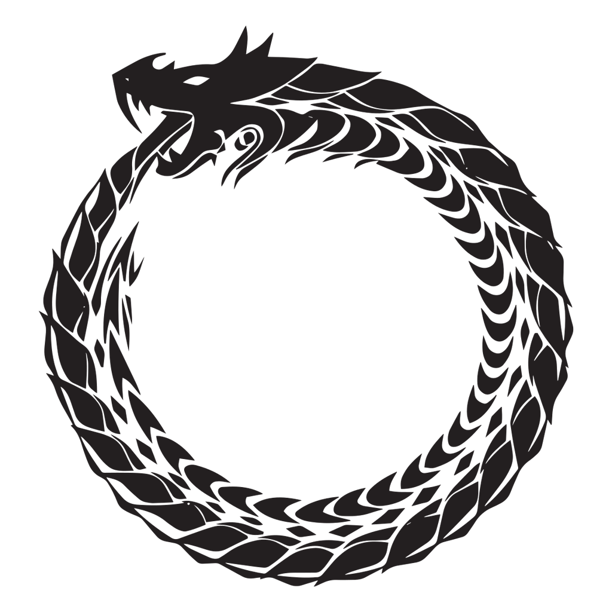

# Uroboros Game Studio
* ***Develop*** branch: 

### Objetivo
Uroboros Game Studio es un editor de videojuegos que utiliza el framework de videojuegos Uroboros.

### Prerequisitos
* Eclipse >= Neon
* JDK >= 8

### Motivación
Esta herramienta está pensada para programadores que quieran crear sus propios videojuegos 2D. La motivación de este proyecto es introducir al programador al ambiente de videojuegos, y ayudarle a pensar en todos los componentes que intervienen en la creación de la misma (como los escenarios, actores, comportamientos, etc.). Y como interactúan entre ellos.

### Dependencias
[Uroboros-Engine](https://github.com/TeamUroboros/Uroboros-Engine/tree/develop)

### Principales casos de Uso

* Crear un nuevo proyecto
	* El usuario debe ingresar una dirección donde crear el proyecto.
	* El usuario debe ingresar un nombre al juego.
* Abrir proyecto
	* El usuario debe ingresar la dirección de la carpeta del proyecto existente.
* Agregar una escena al juego
	* El usuario debe ingresar un nombre para la escena.
* Agregar un objeto de juego a una escena
	* El usuario debe ingresar un nombre para el objeto de escena.
* Ejecutar el juego
	* El usuario debe ejecutar el juego en cualquier momento dado en caso de no haber ninguna inconsistencia.
* Detener la ejecucion del juego
	* El usuario puede detener la ejecución en el caso de que el juego se este ejecutando.
* Cambiar la configuración del juego
	* El usuario puede modificar la dimensión de la pantalla del juego.
* Editar escena
	* El usuario puede cambiar el nombre de la escena salvo que el nombre este en uso
	* El usuario puede redimencionar, pocisionar y agregar una imagen.
* Editar los objeto de juego
	* El usuario puede cambiar el nombre del objeto de juego salvo que este en uso.
	* El usuario puede agregar una imagen al objeto de juego y redimensionarlo.
	* El usuario puede cambiar la posición.
	* El usuario puede habilitar o deshabilitar comportamientos de física.
* Agregar comportamientos
	* El usuario debe agregar un nombre al nuevo comportamiento.
	* El usuario debe poder programar el nuevo comportamiento.
	* El usuario puede habilitar y deshabilitar el nuevo comportamiento.

### Arquitectura

Cuando el usuario quiera agregar una escena al juego, por ejemplo, el sistema responde con el siguiente flujo:

**MainWindowDomain.java** es el moderador entre la vista y el modelo. En caso de necesitarlo, puede solicitar guardar archivos en un directorio predeterminado para el usuario.

**UGSProject.java** es el modelo principal que contiene toda la lógica del proyecto en creación y delegar tareas a otros objetos del dominio.

**Uroboros Engine** sera utilizado como dependencia y es fundamental para el funcionamiento de Uroboros Game Studio, ya que este contiene toda la lógica de juego que usará el proyecto del usuario.

#### Tecnología
> Implementación de Dominio: Java
> Interface de Usuario: Java Swing

### Backlog
* [Trello](https://trello.com/b/Xs1Q6q4e/uroborus-game-studio)
* [VSM](https://realtimeboard.com/app/board/o9J_kxnZcYo=/)

#### Autores:
* Chambi Orellana, Liza Melody
* Guzmán, Gabriel
